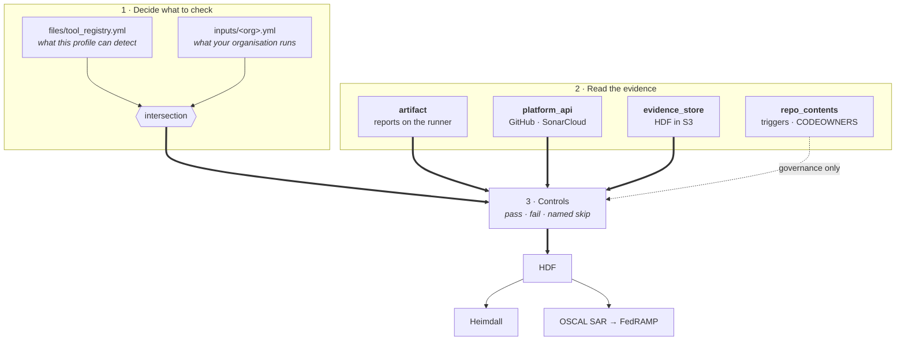

# dev-sec-ops-baseline

An InSpec profile that verifies a **DevSecOps pipeline is actually in place** — that
the expected scans run, that the platform's security controls are switched on, and
that merge protection is enforced.

Quick reference. Every section links to the detail.

| Mode | Needs | Answers |
|---|---|---|
| **Standalone** — against the control plane | A platform token. No pipeline, no runner | Is scanning enabled, are merge rules enforced, what does the vulnerability dashboard hold |
| **Bolt-on** — inside a pipeline | To run after the scanner stages, reports on disk | Did each scan run, and did it emit a valid artifact |

---

## How it works



Three things that diagram is making a point about:

- **The intersection is the whole design.** A scan type is checked when the profile
  can detect it *and* you declared it. Neither file alone decides.
- **`repo_contents` is a dashed line.** A workflow naming a scanner proves someone
  wired it up, not that it ran, so it can answer governance questions and can never
  satisfy a scan type. The other three are execution evidence.
- **Every control lands on pass, fail, or a *named* skip.** There is no "not
  declared" state, because an omission renders as Not Applicable — which reads as
  "does not apply here" rather than "nobody looked".

---

## Quick start

**Standalone.** Reads the control plane; no pipeline required.

```bash
export GITHUB_TOKEN=...
cinc-auditor exec . -t local:// \
  --input-file inputs/example-org.yml \
  --reporter cli json:hdf.json
```

**Bolt-on.** Last step of a pipeline, with `reports/` populated. Filenames are
matched by glob, so timestamped names work as-is.

```bash
cinc-auditor exec . -t local:// \
  --input-file inputs/full-pipeline.yml \
  --input run_mode=pipeline artifact_dir=./reports \
  --reporter cli json:hdf.json
```

> Repeated `--input` flags are **silently dropped** — only the last survives. Use one
> flag with several pairs, or a second `--input-file`.

**Produce evidence from GitHub's dashboards.** A reusable workflow converts code
scanning, secret scanning and Dependabot to HDF. Callers add ~12 lines, pinned to
the **full commit SHA** of a published release with the tag as a trailing comment
— a tag can be moved, a SHA cannot.

```yaml
jobs:
  bridge:
    uses: risk-sentinel/dev-sec-ops-baseline/.github/workflows/dashboard-hdf-emit.yml@<commit-sha>  # <release-tag>
    permissions:
      contents: read
      security-events: read      # without this every capability reads as disabled
      id-token: write
    secrets:
      S3_EMIT_ROLE_ARN: ${{ secrets.MY_REPO_EMIT_ARN }}
      AWS_REGION: ${{ secrets.AWS_REGION }}
```

There is a matching reusable for secret scanning,
[`secret-scan-hdf.yml`](.github/workflows/secret-scan-hdf.yml), which emits an
execution record even when the scan is clean — see
[evidence_sources.md](docs/evidence_sources.md#a-clean-scan-still-produces-evidence).

---

## Documentation

| Topic | Read this |
|---|---|
| Architecture and roadmap | [`docs/Pipeline_Evidence_Plane.html`](docs/Pipeline_Evidence_Plane.html) |
| How checks are selected, and the denominator | [`docs/detection_model.md`](docs/detection_model.md) |
| What is covered, by scan type and by tool | [`docs/coverage.md`](docs/coverage.md) |
| Which FedRAMP KSIs the controls reach | [`docs/ksi_coverage.md`](docs/ksi_coverage.md) |
| Pointing the profile at your evidence | [`docs/evidence_sources.md`](docs/evidence_sources.md) |
| The GitHub dashboard bridge | [`docs/dashboard_bridge.md`](docs/dashboard_bridge.md) |
| Tokens, scopes, and what fails quietly | [`docs/tokens.md`](docs/tokens.md) |
| Running against GitLab, and the three places its merge rules live | [`docs/gitlab.md`](docs/gitlab.md) |
| What is expected at each SDLC stage | [`docs/sdlc/`](docs/sdlc/) |

**Credentials at a glance** — each can be an InSpec input *or* the conventional
environment variable, so an org-level CI secret needs no input plumbing:

| Credential | Input | Environment |
|---|---|---|
| GitHub | `github_token` | `GITHUB_TOKEN`, then `GH_TOKEN` |
| SonarQube | `sonar_token` | `SONAR_TOKEN`, then `SONARQUBE_TOKEN` |
| GitLab | `gitlab_token` | `GITLAB_TOKEN` |

`read:org` is load-bearing and fails *quietly* — see
[tokens.md](docs/tokens.md).

---

## Licence

Apache-2.0. No ownership claims asserted.

[](https://sonarcloud.io/summary/new_code?id=risk-sentinel_dev-sec-ops-baseline)

## Running without GitHub access

Every release carries a `.tar.gz` asset, built and verified by
`.github/workflows/release-artifact.yml`.

It holds this profile. This one declares no `depends:`, so there is no resource
pack to carry, but the asset is still the supported way to move it across to a
consumer who cannot reach github.com.

Assets are attached to every release cut **after this workflow landed**; earlier
releases have none.

```bash
VERSION=<the release you want>

# once, from somewhere that CAN reach GitHub
curl -LO https://github.com/risk-sentinel/dev-sec-ops-baseline/releases/download/$VERSION/dev-sec-ops-v1r1-$VERSION.tar.gz

# then, on the isolated side
mkdir -p dev-sec-ops-v1r1 && tar xzf dev-sec-ops-v1r1-$VERSION.tar.gz -C dev-sec-ops-v1r1
cd dev-sec-ops-v1r1
cinc-auditor exec . -t local:// --input-file inputs/example.yml
```

**Extract it, then run from inside the directory.** That is the shape the CI
templates use and the only one that is tested.

The asset is verified before it is attached: the release job rejects an archive
that declares `depends:` but carries no `vendor/`, and it rejects one that will
not **load with the network switched off**. A tarball that exists is not a
tarball that works.

### From CI

Both templates take `profile_source`, defaulting to `git` — existing callers are
unaffected:

| value | behaviour |
| --- | --- |
| `git` | Vendor from the declared remotes. Needs to reach them. |
| `archive` | Unpack a release artifact. Contacts no remote. Requires `archive_path`. |

`archive` **never falls back to `git`.** An empty or missing `archive_path` fails
the job, as does an archive that declares dependencies but carries none. A
fallback would defeat the isolation the mode exists for *and* still report a
successful scan.

GitHub Actions:

```yaml
uses: risk-sentinel/dev-sec-ops-baseline/.github/workflows/exec-evidence.yml@<version>
with:
  profile_source: archive
  archive_path: ./dev-sec-ops-v1r1-<version>.tar.gz
```

GitLab:

```yaml
include:
  - project: <your-org>/dev-sec-ops-baseline
    ref: <version>
    file: /ci/jobs/exec-evidence.yml
    inputs:
      profile_source: archive
      archive_path: ./dev-sec-ops-v1r1-<version>.tar.gz
```

## Producing evidence

A `--reporter cli` run answers the question. It does not produce something an
assessor can trace back to what was assessed, when, or by whom. For that, use the
CI templates — the whole pipeline, in YAML with no helper scripts behind it:

**GitHub**

```yaml
jobs:
  sweep:
    uses: risk-sentinel/dev-sec-ops-baseline/.github/workflows/exec-evidence.yml@main
    with:
      target: my-org
      boundary: my-boundary
      aws_region: us-east-1
      profile_name: dev-sec-ops-v1r1
      profile_version: "1.1.0"
      inputs_file: inputs/mine.yml
    secrets:
      FORGE_TOKEN: ${{ secrets.DEVSECOPS_SCAN_TOKEN }}
```

**GitLab**

```yaml
include:
  - project: risk-sentinel/dev-sec-ops-baseline
    ref: v0.8.0
    file: /ci/jobs/exec-evidence.yml
    inputs:
      target: my-org
      boundary: my-boundary
      aws_region: us-east-1
      profile_name: dev-sec-ops-v1r1
      profile_version: "1.1.0"
      inputs_file: inputs/mine.yml
```

`target`, `boundary`, `aws_region`, `profile_name` and `profile_version` are
required and have no defaults. A missing one is rejected before the job starts —
GitHub refuses the `workflow_call`, GitLab refuses the `include` — rather than
running against the wrong account or filing the results under the wrong label.
`inputs_file` defaults to `inputs/example.yml`, which runs with example values,
so set it to your own copy. See [docs/ci-templates.md](docs/ci-templates.md) for
the full contract, including which secrets are genuinely optional.

`inputs_file` is **required and deliberately undefaulted**. This profile assesses
an organisation, and defaulting it to ours would silently assess the wrong one
while looking like it worked.

`FORGE_TOKEN` must carry org read including private repositories, and must not be
the default `GITHUB_TOKEN`. Measured against this org: an unauthorised token
enumerates 16 repositories where an authorised one sees 21. The five private
repos drop out **silently**, the denominator shrinks, and reconciliation then
reports five stale declarations that do not exist — a confident false finding, and
exactly the failure class this profile exists to catch.

### Gates

Beyond the shared three (`hdf convert` without `--no-validate`, `hdf label` plus
a `label show` check, `hdf validate`), this pipeline fails the job when any
control reports **"no declared targets"**. That is this profile's own signature
failure: with no declaration loaded, `targets` falls back to its empty default and
every coverage control reports clean having assessed an organisation of nobody.

### Two artifacts

`results.final.json` is HDF v3 — the authoritative, schema-validated evidence
carrying the audit record and the `target` element. `results-heimdall.json` is the
exec-json copy Heimdall loads. The second is a copy, not a conversion: every
conversion path drops fields, and `hdf convert` discards `target` and
`passthrough` outright (mitre/hdf-libs#234), which is why identity is stamped
after conversion rather than before.

